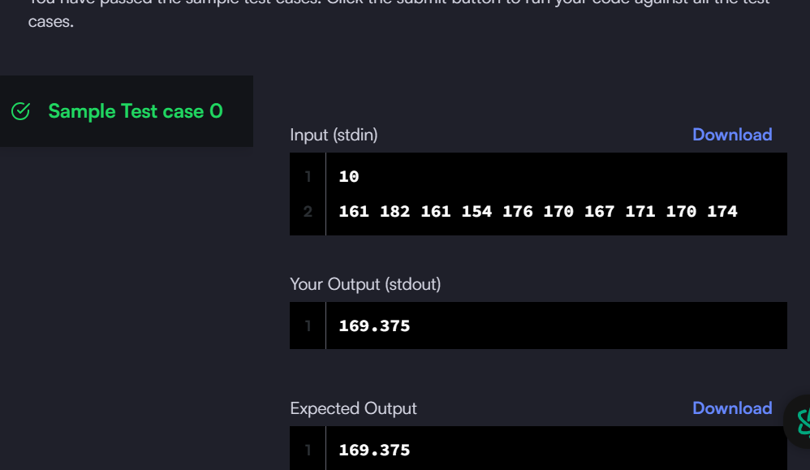
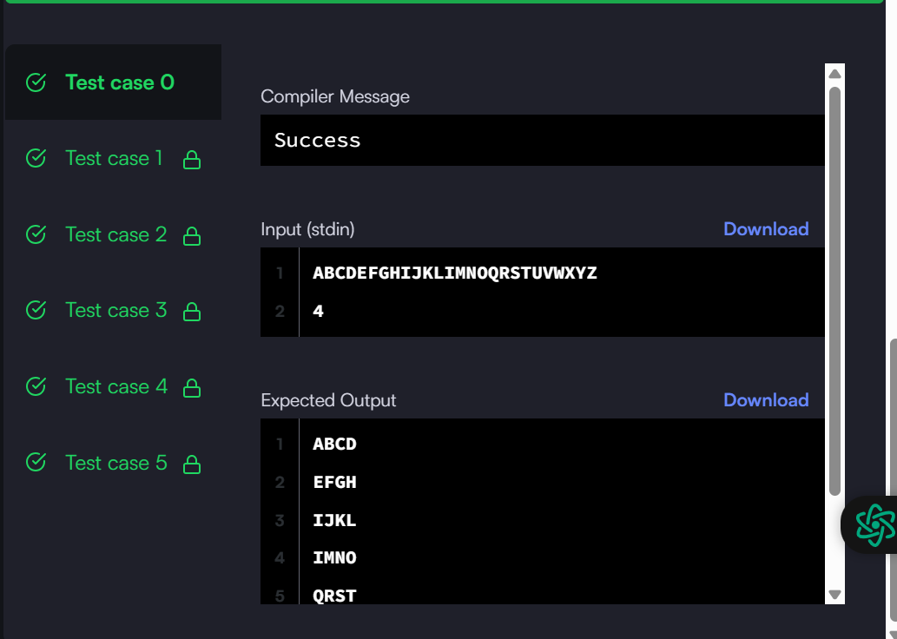
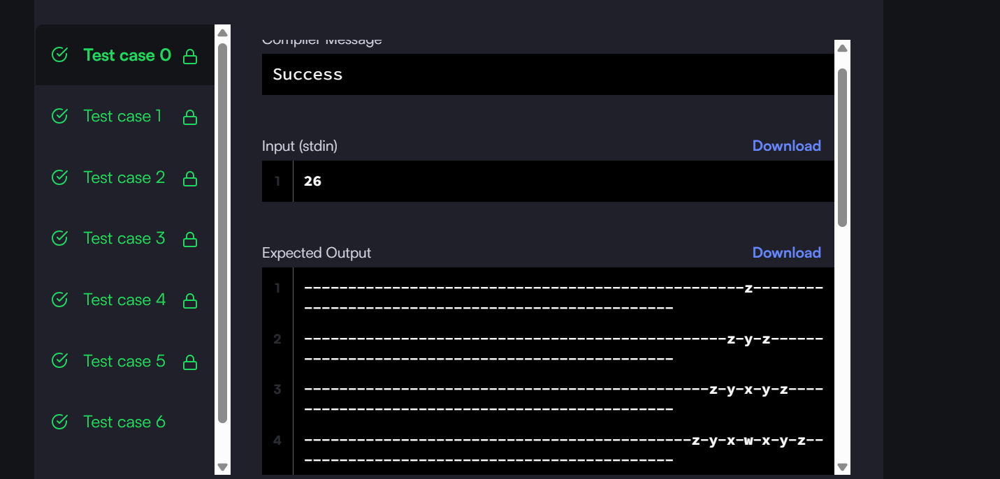
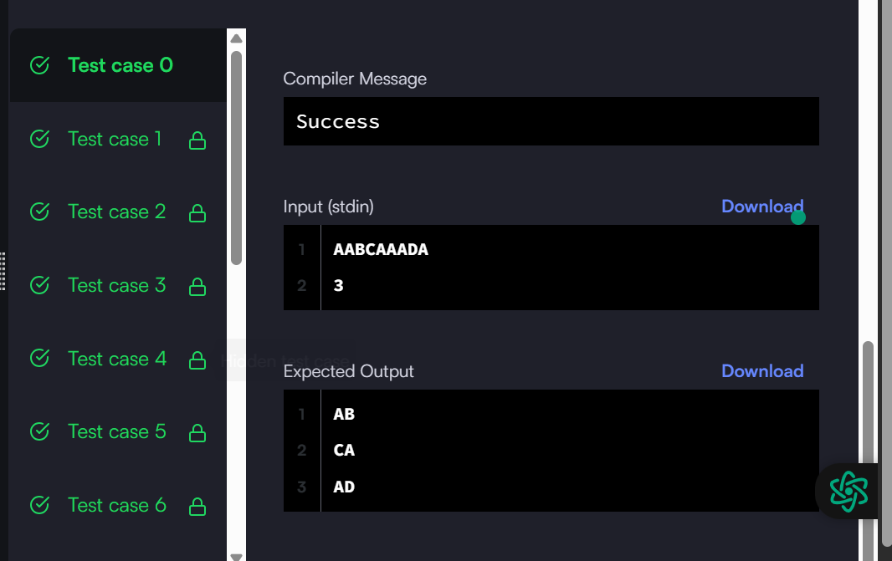
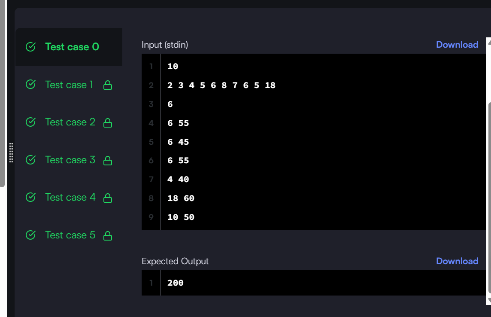

## 1. Capitalize solution
This the solution code and screenshot

## Screenshot

## Solution code 
see [`capitalize_sol`](capitalize_sol.py) for the code

## 2. py-introduction-to-sets : Calculate the avarges of items present inside a python set
This Solution code and screenshot
## Screenshot

## Solution code
see [`py-introduction-to-sets_sol.py`](py-introduction-to-sets_sol.py) for the code
## 3. text-wrap : Task to wrap the string into a paragraph of given width .
This Solution code and screenshot
## Screenshot

## Solution code
see [`Text-Wrap`](text-wrap_sol.py) for the code

## 4. Alphabet Rangoli Solution

This is the solution code for the Alphabet Rangoli problem.

## Screenshot

## Solution Code

See [`alphabet-rangoli_sol.py`](alphabet-rangoli_sol.py) for the code.
## 5. merge-the-tools : Split a string into equal parts of length and Convert each parts by removing any subsequent occurrences of non-distinct

This is the solution code   problem.

## Screenshot

## Solution Code

See [`Merge-the-tool`](Mereg_tool_sol.py) for the code.

## 6. collections-counter : calculate the total earned amount

This is the solution code for   problem.

## Screenshot

## Solution Code

See [`Collection Count`](collection_count.py) for the code.

